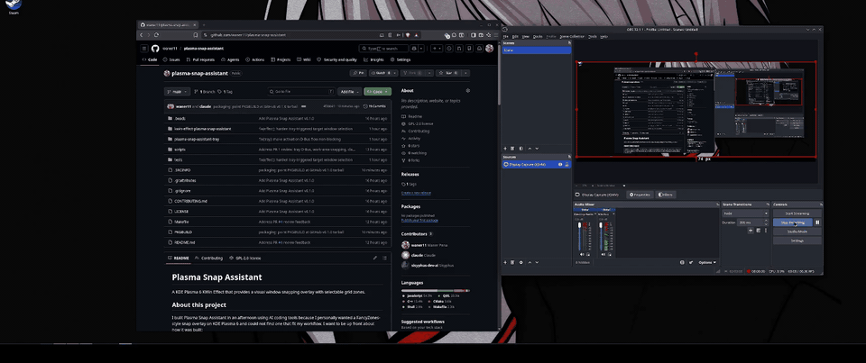

# Plasma Snap Assistant

A KDE Plasma 6 KWin Effect that provides a visual window snapping overlay with selectable grid zones.



## About this project

I built Plasma Snap Assistant in an afternoon using AI coding tools because I
personally wanted a FancyZones-style snap overlay on KDE Plasma 6 and could not
find one that fit my workflow. I want to be up front about how it was built:

- **AI-assisted.** The bulk of the code in this repository — the KWin Effect
  QML, the C++ tray companion, the build and packaging glue, and the tests —
  was written with the help of AI coding assistants. I reviewed, tested, and
  iterated on the output, but I did not hand-write most of it from scratch.
- **Not a C++ expert.** The tray companion is C++/Qt6/KF6. I am not proficient
  in C++. If you spot something that looks off in that code, please open an
  issue or a PR — informed review is very welcome.
- **Small, personal tool.** This started as a scratch-my-own-itch project, not
  a polished product. It works for my setup; your mileage may vary.

Contributions, bug reports, and honest feedback are very welcome.

## Features

- Press Meta+J to open a grid overlay on the active window's monitor
- Three grid densities: 8x6 (48 cells), 6x4 (24 cells), 4x4 (16 cells)
- Switch density via keyboard (1/2/3) or by clicking the density bar
- Click a cell to snap the focused window to that cell
- Click and drag across cells to snap to a multi-cell region
- Escape or right-click to cancel without changing window geometry
- Window eligibility filtering (rejects fullscreen, dock, dialog, etc.)
- Multi-monitor aware: overlay appears on the active window's monitor only
- System tray icon (provided by a separate tray companion; autostarts after `make install`)
- KConfig settings for default density and shortcut key
- Tested on KWin X11; built with standard KWin QML types that are also available on Wayland

## Requirements

- KDE Plasma 6
- Qt 6
- KDE Frameworks 6
- `kpackagetool6`, `kwriteconfig6`, `qdbus6` (included with Plasma 6)
- CMake 3.20+ and a C++17 compiler (for the tray companion)

## Installation

### From AUR (Arch Linux)

```bash
yay -S plasma-snap-assistant
```

### Using the Makefile

```bash
make install       # Install effect (per-user) + install tray system-wide
```

This target:

- installs the KWin effect to `~/.local/share/kwin/effects/` via `kpackagetool6`
  (no sudo),
- builds the tray with `-DCMAKE_INSTALL_PREFIX=/usr` and runs
  `sudo cmake --install`, which places:
  - `/usr/bin/plasma-snap-assistant-tray`
  - `/usr/share/icons/hicolor/scalable/apps/plasmasnap-grid.svg`
  - `/usr/share/applications/plasma-snap-assistant-tray.desktop`
  - `/etc/xdg/autostart/plasma-snap-assistant-tray.desktop`
  - `/etc/xdg/plasma-snap-assistantrc` (system-wide tray default config)

You will be prompted for your sudo password during the tray step.

The tray icon will appear in your Plasma system tray automatically on next
login. To start it immediately in the current session:

```bash
plasma-snap-assistant-tray &
```

To remove everything:

```bash
make uninstall     # Removes effect + tray (uses sudo for the tray)
```

### Manual installation

```bash
# Install KWin Effect
kpackagetool6 --type=KWin/Effect --install kwin-effect-plasma-snap-assistant/
kwriteconfig6 --file kwinrc --group Plugins --key plasma-snap-assistantEnabled true
qdbus6 org.kde.KWin /KWin reconfigure

# Build + install tray companion (installs to /usr/bin, hicolor icon theme,
# and /etc/xdg/autostart so it starts with the Plasma session)
cmake -S plasma-snap-assistant-tray -B plasma-snap-assistant-tray/build \
    -DCMAKE_INSTALL_PREFIX=/usr \
    -DCMAKE_BUILD_TYPE=Release
cmake --build plasma-snap-assistant-tray/build
sudo cmake --install plasma-snap-assistant-tray/build

# Start it now (it will also autostart on next login)
plasma-snap-assistant-tray &
```

### Restarting KWin to pick up QML changes

`qdbus6 org.kde.KWin /KWin reconfigure` reloads configuration but **not** compiled QML.
When updating the effect's QML, restart KWin via one of these:

```bash
# From KRunner (Alt+F2), type:
kwin_x11 --replace   # on X11
kwin_wayland --replace   # on Wayland

# Or from any terminal, detached so closing the terminal won't kill it:
nohup kwin_x11 --replace >/dev/null 2>&1 & disown
```

Never `Ctrl+C` a running `kwin_*` — it leaves the session without a window manager.
`--replace` atomically swaps the old process for the new one.

## Usage

- **Meta+J** -- open the snapping overlay on the active window's monitor
- **Click** a cell to snap the focused window to that zone
- **Click and drag** across cells to snap to a multi-cell region
- **1 / 2 / 3** or click the density bar to switch grid density
- **Escape** or **right-click** to cancel without changing window geometry

## Configuration

Set the default grid density:

```bash
kwriteconfig6 --file kwinrc --group PlasmaSnap --key defaultDensity "6x4"
```

Change the shortcut key:

```bash
kwriteconfig6 --file kwinrc --group PlasmaSnap --key shortcutKey "Meta+G"
```

Enable or disable the tray icon:

```bash
kwriteconfig6 --file plasma-snap-assistantrc --group General --key trayIconEnabled true
```

After any configuration change, reload KWin:

```bash
qdbus6 org.kde.KWin /KWin reconfigure
```

## Architecture

Plasma Snap Assistant uses an effect-centric architecture:

- **KWin Effect** (`kwin-effect-plasma-snap-assistant/`) -- A `KWinComponents.SceneEffect` that owns shortcut registration, overlay rendering, and window placement. No KWin Script is needed.
- **Tray Companion** (`plasma-snap-assistant-tray/`) -- A lightweight system tray icon using `KStatusNotifierItem`. It activates the effect via `KGlobalAccel::invokeShortcut` over DBus.

Configuration lives in `contents/config/main.xml` (not a `.kcfg` file).

### Rendering layers

The SceneEffect delegate is opaque by default, so the desktop has to be rendered
explicitly. Bottom to top:

1. `KWinComponents.DesktopBackground` -- wallpaper
2. `KWinComponents.WindowThumbnail` repeater over `WindowFilterModel` -- open windows in their real positions
3. Semi-transparent dark tint
4. Grid cells (on the target screen only)
5. Density bar

## Development

```bash
make install        # Install effect (per-user) + install tray system-wide (sudo)
make uninstall      # Remove effect + tray
make clean          # Clean build artifacts
```

Run tests:

```bash
make test
```

All runtime log output uses the `[PlasmaSnap]` prefix.

## License

GPL-2.0-or-later. See [LICENSE](LICENSE) for the full text.
